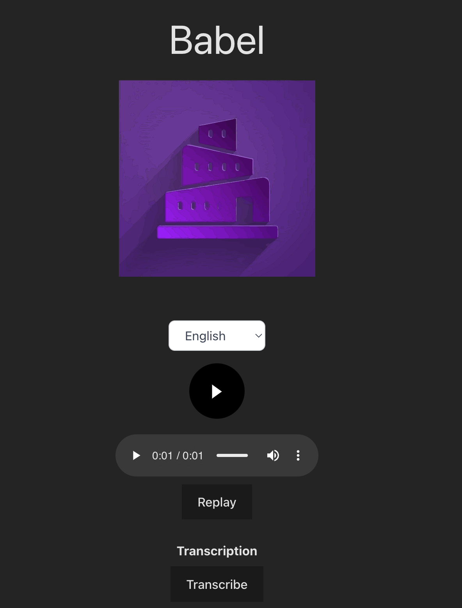

# Babel 

It performs same-voice live translation by recording the user's audio transcribing their audio with [OpenAI's Whisper](https://platform.openai.com/docs/guides/speech-to-text)  to transcribe along with GPT-3.5 for text-to-text translation. Then it uses [Coqui XTTS-v2](https://huggingface.co/coqui/XTTS-v2) a multi-lingual voice cloning model hosted on [Modal Labs](https://modal.com/) to generate speech in your voice in a different language! 

You can try the demo out [here](https://babel-2opttx3dcq-uc.a.run.app/)!

Voice recordings are not stored and are only used to generate a new wav file that is published with an ephemeral AWS S3 Audio Blob.



### Development

If you want to develop on this, you should add credentials following .env.example

Additionally,

To run the backend 
```
npm install 
npm run build 
npm run start
```

To run the frontend 
```
cd client/src
npm install 
npm run dev 

```

If you want to updated the model hosted on Modal. 
You should edit this models/tts_web.py and serve it like this:

```
modal serve models/tts_web.py
```


This was heavily inspired by [Quillman](https://github.com/modal-labs/quillman/tree/main) where I learned a lot about how powerful and expressive Modal can be for deploying machine learning applications.